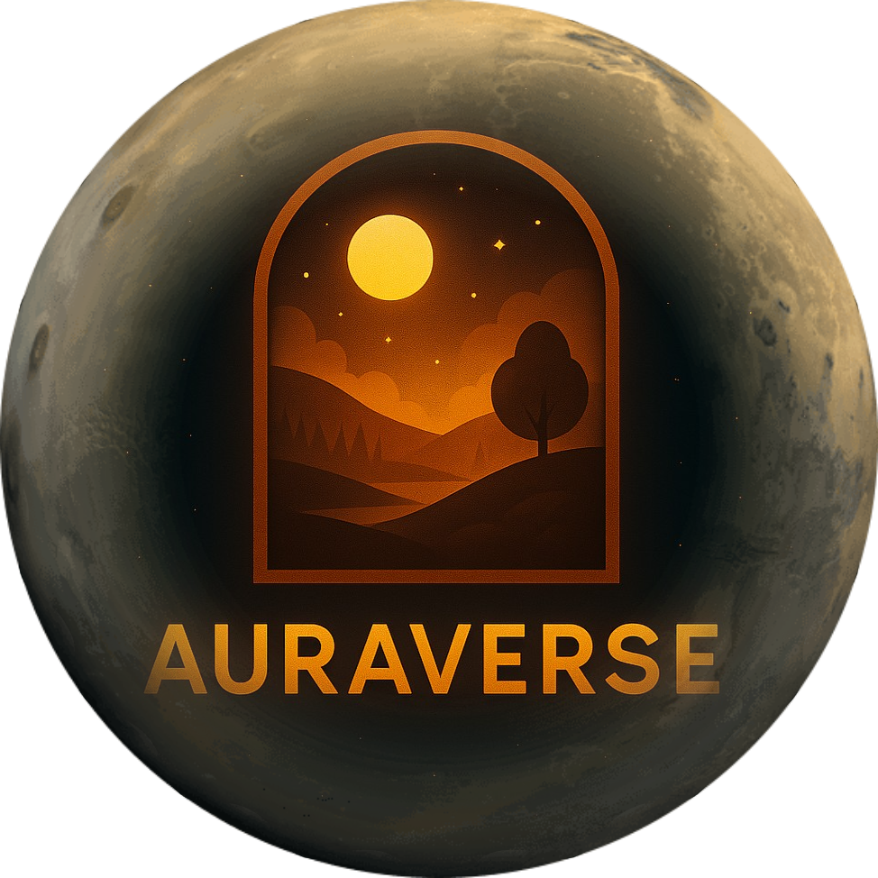

<div id="top">

<!-- HEADER STYLE: CLASSIC -->
<div align="center">



# AURA-VERSE

<em></em>

<!-- BADGES -->
<!-- local repository, no metadata badges. -->

<em>Built with the tools and technologies:</em>


<br>


</div>
<br>

---

> [!NOTE]
> This project is currently under development.

---

## Table of Contents

- [Table of Contents](#table-of-contents)
- [Overview](#overview)
- [Features](#features)
- [Project Structure](#project-structure)
  - [Project Index](#project-index)
- [Getting Started](#getting-started)
  - [Prerequisites](#prerequisites)
  - [Installation](#installation)
  - [Usage](#usage)
  - [Testing](#testing)
- [Roadmap](#roadmap)
- [Contributing](#contributing)
- [License](#license)
- [Acknowledgments](#acknowledgments)

---

## 🧭Overview

AuraVerse is a mood-based recommendation engine built on a robust full-stack foundation. Using user input and backend intelligence, it deciphers emotional context to deliver personalized suggestions — ranging from movies and music to books and environmental settings.
Powered by Express, MongoDB, TypeScript, and NLP-driven logic, AuraVerse bridges technology and intuition to craft a truly responsive experience.

---

## Features

❯ 🔐 Secure authentication using bcrypt and JWT tokens  
❯ 👤 Profile customization with avatar, name, and bio  
❯ 🧠 AI backend with NLP logic to parse emotional input  
❯ 📈 Real-time mood response based on user selections  
❯ 📚🎶📽️ Multi-domain recommendation system for books, music, movies & more  
❯ 🗂️ Modular Express + Flask backend with RESTful APIs  
❯ 🌐 Next.js frontend for reactive, accessible UI  
❯ 🛡️ Backend scalability and data security baked into architecture

---

## Project Structure

```sh
└── aura-verse/
    ├── client
    │   ├── .gitignore
    │   ├── components.json
    │   ├── eslint.config.mjs
    │   ├── next.config.ts
    │   ├── package-lock.json
    │   ├── package.json
    │   ├── postcss.config.mjs
    │   ├── public
    │   ├── README.md
    │   ├── src
    │   └── tsconfig.json
    ├── mood-ai-backend
    │   ├── __pycache__
    │   ├── app.py
    │   ├── model.pkl
    │   ├── mood_dataset.csv
    │   ├── mood_trainer.py
    │   ├── requirements.txt
    │   └── vectorizer.pkl
    └── server
        ├── .gitignore
        ├── index.ts
        ├── middleware
        ├── models
        ├── node_modules
        ├── package-lock.json
        ├── package.json
        ├── routes
        ├── tsconfig.json
        ├── types
        └── utils
```

---

## Getting Started

### Prerequisites

This project requires the following dependencies:

- **Programming Language:** TypeScript
- **Package Manager:** Npm, Pip
- **Container Runtime:** Docker

### Installation

Build aura-verse from the source and install dependencies:

1. **Clone the repository:**

   ```sh
   ❯ git clone https://github.com/5Rashmi/aura-verse.git
   ```

2. **Navigate to the project directory:**

   ```sh
   ❯ cd aura-verse
   ```

3. **Install the dependencies:**

   ```sh
   ❯ docker build -t aura-verse .
   ```

   ```sh
   ❯ npm install
   ```

   ```sh
   ❯ pip install -r requirements.txt
   ```

### Usage

Run the project with:

**Using [docker](https://www.docker.com/):**

```sh
docker run -it aura-verse
```

**Using [npm](https://www.npmjs.com/):**

```sh
npm run dev      # For client inside client dir
npm run server   # For server inside server dir
```

**Using [pip](None):**

```sh
python app.py
```

### Testing

Aura-verse uses the {**test_framework**} test framework. Run the test suite with:

**Using [npm](https://www.npmjs.com/):**

```sh
npm test   # (To be configured)
```

**Using [pip](None):**

```sh
# Python tests coming soon (e.g. pytest or unittest)
```

---

## Roadmap

Your personalized realm evolves with every line of code. Here's what's been achieved — and what awaits ✨

- [x] 🔐 **Secure Authentication** – Implemented user login/signup with robust Clerk integration
- [x] 👤 **Profile Customization** – Built customizable user avatars, descriptions, and mood settings
- [x] 🏠 **Homepage UI** – Designed a cozy, desktop-style dashboard with ambient widgets
- [x] 🧠 **Mood AI Backend** – Created backend logic to respond dynamically based on mood triggers
- [ ] 📊 **User Selection Parsing** – Capture user preferences and generate mood profiles using NLP
- [ ] 📚🎶📽️ **Smart Recommendations** – Suggest books, music, movies & anime based on mood and interests

---

## Contributing

- **💬 [Join the Discussions](https://github.com/5Rashmi/aura-verse/discussions)**: Share your insights, provide feedback, or ask questions.
- **🐛 [Report Issues](https://github.com/5Rashmi/aura-verse/issues)**: Submit bugs found or log feature requests for the `aura-verse` project.

<details closed>
<summary>Contributing Guidelines</summary>

1. **Fork the Repository**: Start by forking the project repository to your LOCAL account.
2. **Clone Locally**: Clone the forked repository to your local machine using a git client.
   ```sh
   git clone ./aura-verse
   ```
3. **Create a New Branch**: Always work on a new branch, giving it a descriptive name.
   ```sh
   git checkout -b new-feature-x
   ```
4. **Make Your Changes**: Develop and test your changes locally.
5. **Commit Your Changes**: Commit with a clear message describing your updates.
   ```sh
   git commit -m 'Implemented new feature x.'
   ```
6. **Push to LOCAL**: Push the changes to your forked repository.
   ```sh
   git push origin new-feature-x
   ```
7. **Submit a Pull Request**: Create a PR against the original project repository. Clearly describe the changes and their motivations.
8. **Review**: Once your PR is reviewed and approved, it will be merged into the main branch. Congratulations on your contribution!
</details>

<details closed>
<summary>Contributor Graph</summary>
<br>
<p align="left">
   <a href="https://LOCAL{//aura-verse/}graphs/contributors">
      
   </a>
</p>
</details>

---

## License

Aura-verse is protected under the MIT License. For more details, refer to the [LICENSE](LICENSE) file.

---

## Acknowledgments

- Credit `contributors`, `inspiration`, `references`, etc.

<div align="right">

[![][back-to-top]](#top)

</div>

[back-to-top]: https://img.shields.io/badge/-BACK_TO_TOP-151515?style=flat-square

---
